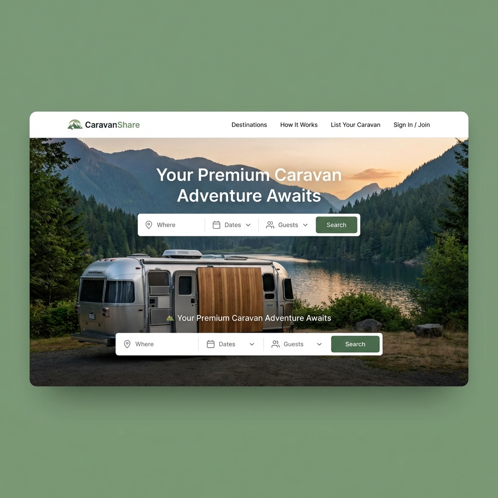
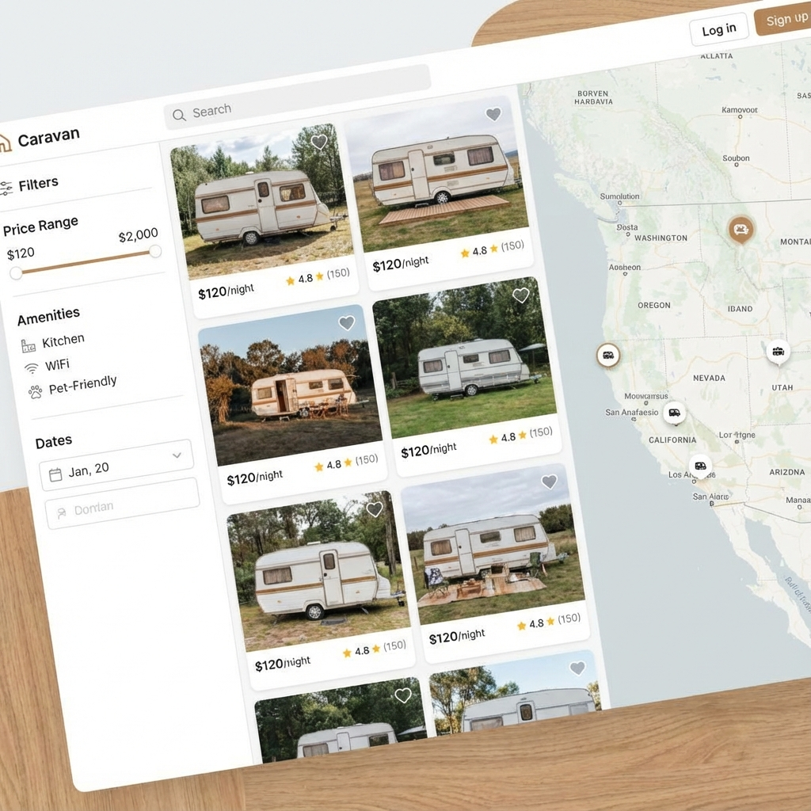
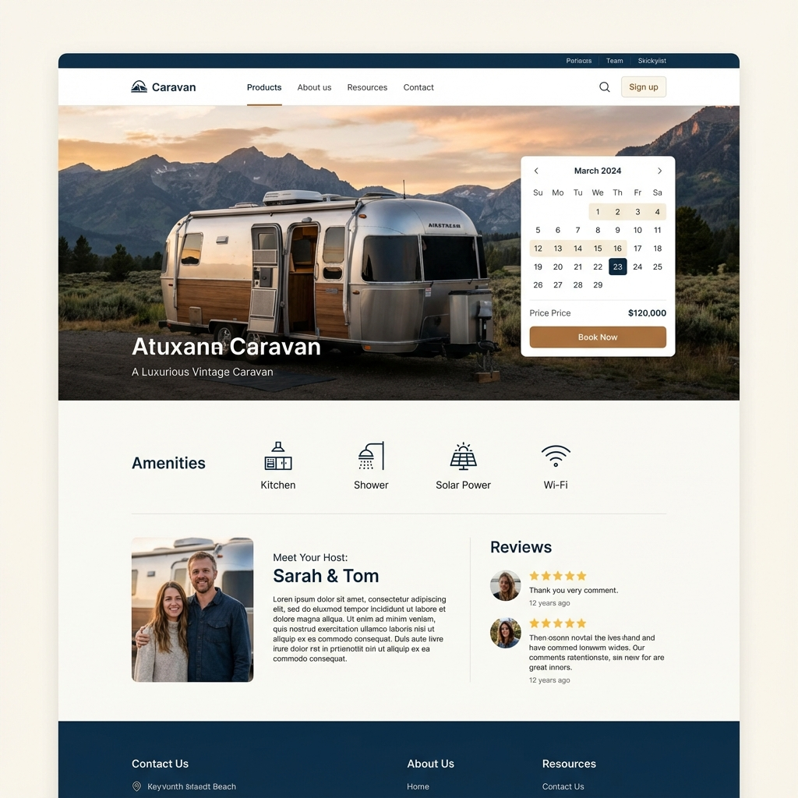
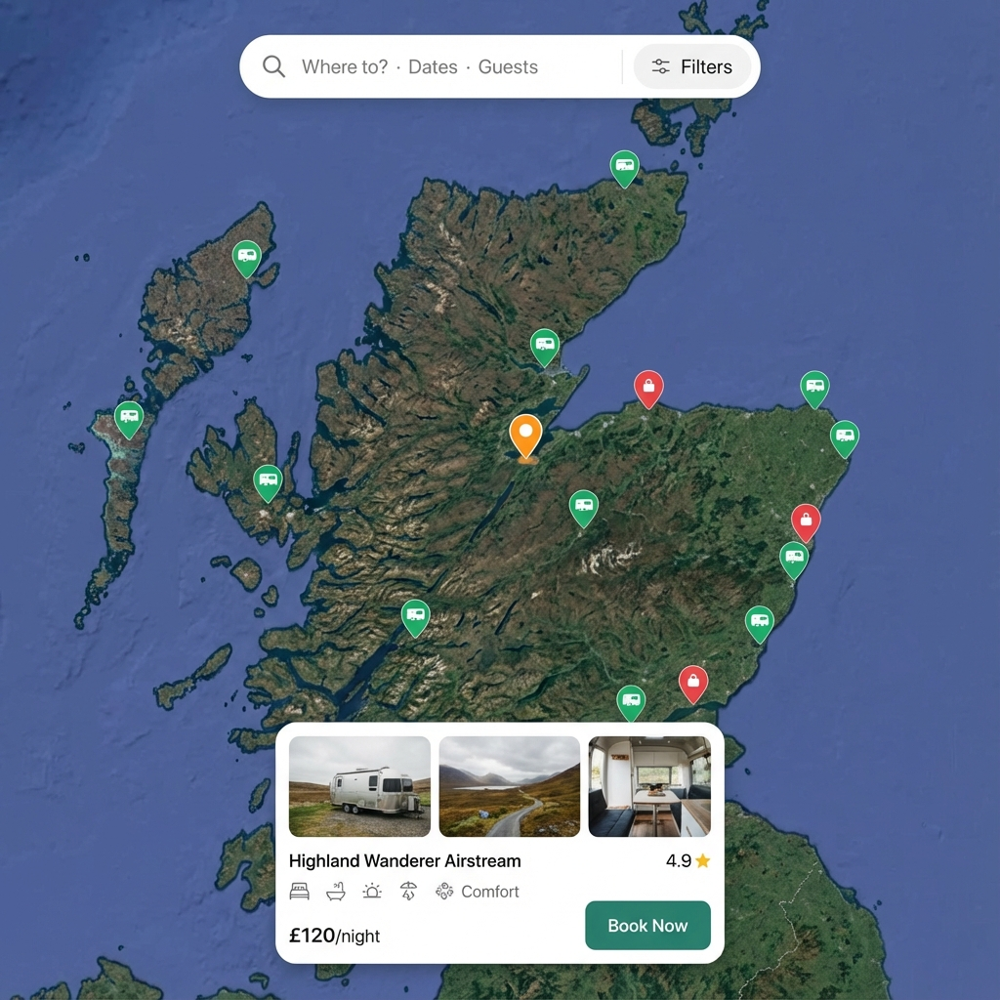
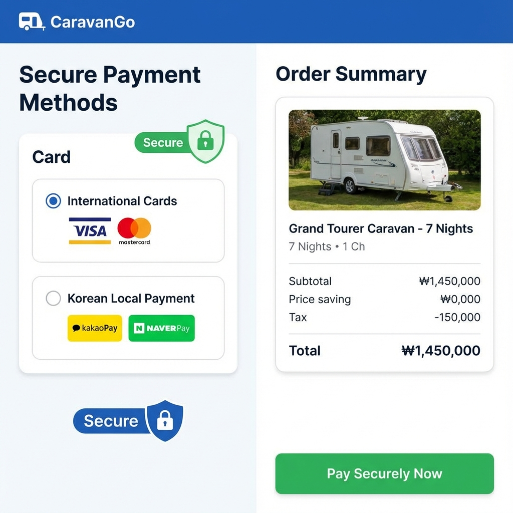
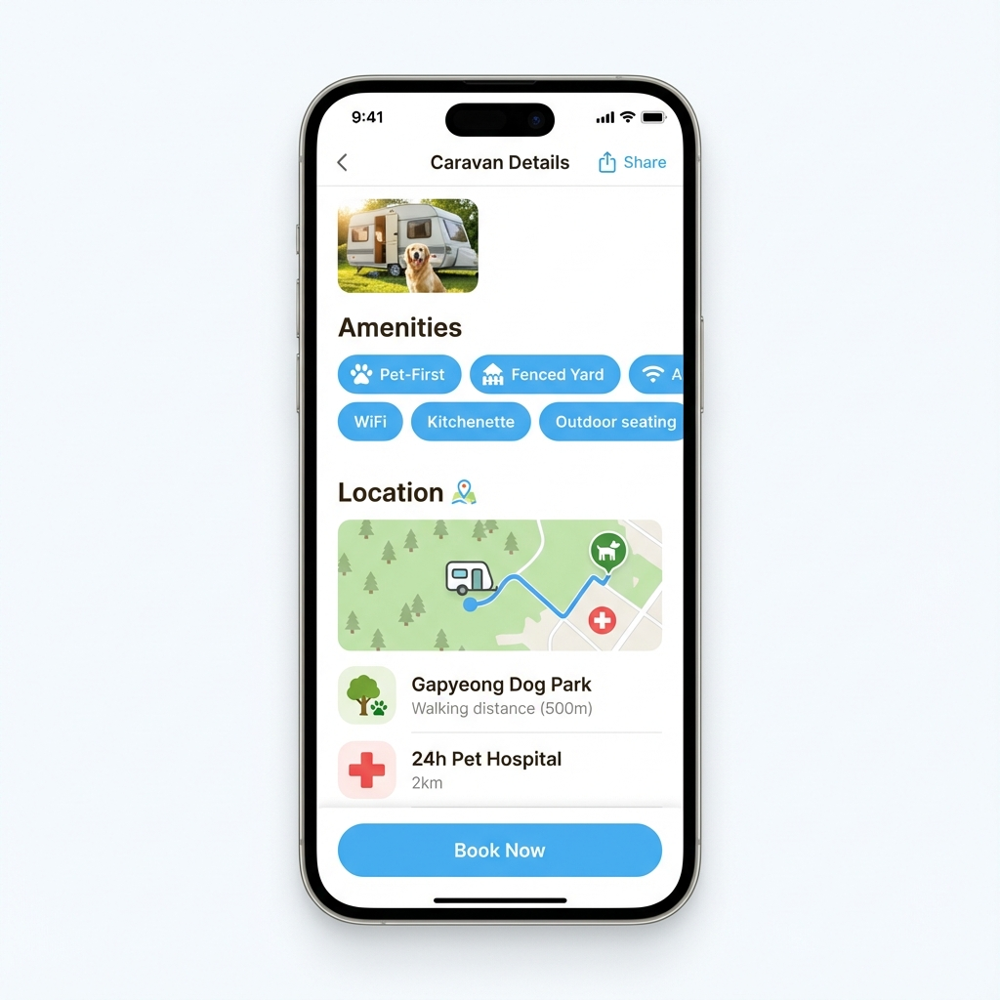
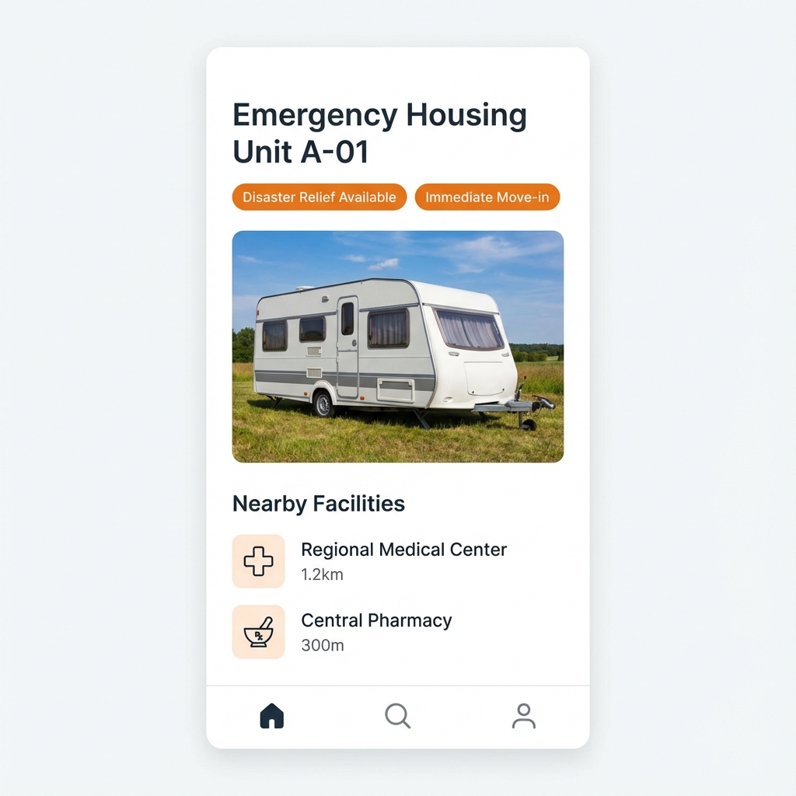

# Karavan (카라반) - 프리미엄 P2P 카라반 공유 플랫폼


**Karavan**은 유휴 카라반을 소유한 호스트와 특별한 캠핑 경험을 찾는 게스트를 연결하는 **P2P 카라반 공유 플랫폼**입니다.
단순한 예약 서비스를 넘어, 누구나 쉽게 아웃도어 라이프를 즐길 수 있는 세상을 만듭니다.

---

## � Preview (미리보기)

| 메인 화면 (Landing) | 목록 화면 (Listing) | 상세 화면 (Detail) |
| :---: | :---: | :---: |
|  |  |  |

| 지도 검색 & 앱 연동 (Map & Navigation) | 결제 시스템 (Payment) | |
| :---: | :---: | :---: |
|  |  | |

## �📖 목차

1. [Why Karavan? (기획 배경 및 문제 해결)](#-why-karavan-기획-배경-및-문제-해결)
2. [What We Learned (배운 점)](#-what-we-learned-배운-점)
3. [Key Features (주요 기능 및 장점)](#-key-features-주요-기능-및-장점)
4. [Technical Differentiators (기술적 차별화)](#-technical-differentiators-기술적-차별화)
5. [Tech Stack (기술 스택)](#-tech-stack-기술-스택)
6. [Getting Started (설치 및 실행)](#-getting-started-설치-및-실행)
7. [Deployment (배포)](#-deployment-배포)

---

## � Why Karavan? (기획 배경 및 문제 해결)

### "왜 이 프로젝트를 시작했나요?"
캠핑 인구가 700만 시대를 맞이했지만, **카라반 캠핑의 진입 장벽**은 여전히 높습니다. 카라반은 구매 비용이 비싸고, 주차 공간 확보가 어려우며, 유지 관리가 까다롭습니다. 반면, 이미 카라반을 소유한 사람들은 1년 중 대부분의 시간을 주차장에 세워두며 **자산의 비효율**을 겪고 있습니다.

### "어떤 문제를 해결하나요?"
**Karavan**은 '공유'를 통해 이 두 가지 문제를 동시에 해결합니다.

1.  **게스트의 진입 장벽 해소**: 고가의 장비 구매나 견인 면허 없이도, 합리적인 비용으로 프리미엄 카라반 캠핑을 경험할 수 있습니다.
2.  **호스트의 수익 창출**: 방치된 카라반을 대여하여 유지비를 충당하고 추가 수익을 창출할 수 있습니다.
3.  **자원의 효율적 활용**: 유휴 자산을 공유함으로써 불필요한 생산을 줄이고 지속 가능한 캠핑 문화를 만듭니다.

---

## 🎓 What We Learned (배운 점)

이 프로젝트를 통해 단순한 기능 구현을 넘어 **안정적이고 확장 가능한 서비스**를 구축하는 과정을 경험했습니다.

1.  **End-to-End Type Safety의 중요성**: 프론트엔드부터 백엔드, 데이터베이스까지 TypeScript와 Prisma를 활용해 타입을 일치시킴으로써, 런타임 에러를 획기적으로 줄이고 개발 생산성을 높이는 경험을 했습니다.
2.  **Docker 기반의 인프라 구축**: 개발 환경과 배포 환경의 일치(Parity)를 위해 Docker Compose를 적극 활용했습니다. 이를 통해 "내 컴퓨터에서는 되는데?"라는 고질적인 문제를 해결하고, 배포 프로세스를 표준화했습니다.
3.  **지리 공간 데이터(Geospatial Data) 처리**: Leaflet 라이브러리를 활용해 지도 기반 서비스를 구현하며, 좌표 데이터를 효율적으로 다루고 사용자에게 직관적으로 시각화하는 방법을 익혔습니다.
4.  **사용자 경험(UX) 중심 설계**: 복잡할 수 있는 예약 및 결제 프로세스를 '모의 결제'와 '실시간 상태 업데이트'를 통해 직관적으로 풀어내며, 사용자의 흐름을 끊지 않는 UI/UX 설계의 중요성을 배웠습니다.

---

## ✨ Key Features (주요 기능 및 장점)

Karavan은 사용자의 편의를 최우선으로 고려한 기능들을 제공합니다.

### 1. 직관적인 탐색 (Discovery)
- **지도 기반 검색**: 리스트 방식뿐만 아니라 지도를 통해 여행지 주변의 카라반을 직관적으로 찾을 수 있습니다.
- **스마트 필터**: 가격, 편의시설, 위치 등 세밀한 조건으로 나에게 딱 맞는 카라반을 검색합니다.

### 2. 매끄러운 예약 경험 (Seamless Booking)
- **실시간 예약 시스템**: 호스트와 게스트 간의 불필요한 조율 없이, 캘린더에서 가능한 날짜를 선택하고 즉시 예약할 수 있습니다.
- **투명한 가격 정책**: 숨겨진 비용 없이 총 결제 금액을 명확하게 보여줍니다.

### 3. 신뢰와 안전 (Trust & Safety)
- **역할 전환 시스템**: 하나의 계정으로 호스트와 게스트 역할을 자유롭게 오갈 수 있어 유연한 사용이 가능합니다.
- **클린 리뷰**: 실제 이용자만 작성할 수 있는 리뷰 시스템으로 정보의 신뢰도를 보장합니다.

---

## 🌟 New Features (v2.0)

사용자의 피드백을 반영하여 사회적 가치를 창출하고, 더욱 개인화된 경험을 제공하는 새로운 기능들이 추가되었습니다.

### 1. 🐾 Pet-First Travel (반려동물 전용 여행)

단순히 "반려동물 동반 가능"을 넘어, 반려동물을 위한 시설이 완비된 카라반을 큐레이션합니다.



- **Special Tag**: `Pet-First` 태그가 부착된 카라반은 울타리, 펫 드라이룸 등 전용 시설을 갖추고 있습니다.
- **Pet-Friendly Amenities**: 주변의 **동물 병원(24h Pet Hospital)**, **반려견 놀이터(Dog Park)** 등의 위치와 거리를 아이콘으로 직관적으로 제공하여 안심하고 여행할 수 있습니다.

### 2. 🚑 Disaster Relief Housing (재난 구호 하우징)

국가적 재난이나 긴급 상황 발생 시, 유휴 카라반을 임시 거처로 활용할 수 있도록 지원합니다.



- **Emergency Tag**: `Disaster Relief Available` 태그는 즉시 입주 가능하며, 구호 활동을 위한 최소한의 설비가 갖춰져 있음을 의미합니다.
- **Medical Access**: 긴급 상황에 대비해 가장 가까운 **종합 병원(Medical Center)**, **약국(Pharmacy)** 정보를 최우선으로 표시합니다.

### 3. 📍 Nearby Amenities Integration (주변 편의시설 연동)

여행의 질을 높여주는 주변 편의시설 정보를 상세 페이지에서 바로 확인할 수 있습니다.

- **직관적인 아이콘 시스템**:
    - 🏥 **병원 (Hospital)**: 응급 상황 대비
    - 🛒 **마트/편의점 (Mart)**: 식료품 및 생필품 구매
    - 🌳 **공원 (Park)**: 산책 및 휴식 공간
    - ☕ **카페 (Cafe)**: 여유로운 휴식
- **거리 정보 (Distance)**: 현재 카라반 위치를 기준으로 직선/도보 거리를 계산하여 표시합니다.

---

## � Detailed Feature Workflows (기능 상세 작동 방식)

### 1. 지도 기반 탐색 및 길찾기 연동 (Map Integration)
Karavan은 **Leaflet.js**와 **OpenStreetMap**을 활용하여 전 세계 어디서나 사용 가능한 지도 서비스를 제공합니다.

-   **동적 클러스터링**: 수많은 카라반 핀이 지도에 표시될 때, 성능 저하 없이 부드럽게 렌더링되도록 최적화되었습니다.
-   **양방향 인터랙션**: 지도의 핀을 클릭하면 하단에 요약 카드가 뜨고, 리스트의 카드를 클릭하면 지도가 해당 위치로 이동합니다.
-   **외부 앱 연동**: 상세 페이지의 **'길찾기(Get Directions)'** 버튼을 클릭하면, 사용자의 디바이스 환경을 감지하여 **네이버 지도, 카카오맵, 또는 Google Maps** 앱을 자동으로 실행하고 목적지를 설정합니다.

### 2. 글로벌 결제 시스템 (Global Payment Gateway)
국내외 사용자를 모두 포용하기 위해 **이원화된 결제 프로세스**를 설계했습니다.

-   **International Cards**: Visa, Mastercard 등 해외 카드를 위한 결제 흐름을 제공합니다. (Stripe 스타일 UI)
-   **Local Payment**: 한국 사용자를 위해 **카카오페이, 네이버페이** 등 간편 결제 옵션을 제공합니다.
-   **Mock Payment Engine**: 현재 데모 버전에서는 실제 과금 없이 결제 성공/실패 시나리오를 테스트할 수 있는 **자체 개발 Mock 엔진**이 탑재되어 있어, 개발 및 시연 단계에서 안전하게 기능을 검증할 수 있습니다.

### 3. 예약 및 승인 프로세스 (Reservation Flow)
예약 시스템은 **상태 머신(State Machine)** 기반으로 견고하게 설계되었습니다.

1.  **Request (요청)**: 게스트가 날짜를 선택하고 결제를 완료하면 `PENDING` 상태로 예약이 생성됩니다.
2.  **Validation (검증)**: 백엔드에서 해당 날짜의 중복 예약 여부, 가격 변동 등을 실시간으로 재검증합니다.
3.  **Confirmation (확정)**: 검증이 통과되면 예약 상태가 `CONFIRMED`로 변경되고, 호스트와 게스트에게 알림이 전송됩니다.
4.  **Review (리뷰)**: 체크아웃 날짜가 지나면 게스트는 리뷰를 작성할 수 있는 권한을 얻게 됩니다.

---

## �🚀 Technical Differentiators (기술적 차별화)

### 1. 견고한 아키텍처 (Robust Architecture)
- **Layered Pattern**: `Controller` - `Service` - `Repository` 계층 분리를 통해 비즈니스 로직의 응집도를 높이고 결합도를 낮췄습니다.
- **Dependency Injection**: 의존성 주입을 통해 테스트 용이성을 확보하고 유연한 확장이 가능하도록 설계했습니다.

### 2. 자동화된 품질 관리 (CI/CD)
- **GitHub Actions**: 코드가 푸시될 때마다 유닛 테스트와 빌드 검증이 자동으로 수행되어, 항상 배포 가능한 상태(Deployable State)를 유지합니다.

### 3. 최적화된 성능 (Performance)
- **Vite & React**: 최신 빌드 도구인 Vite를 사용하여 빠른 HMR(Hot Module Replacement)과 빌드 속도를 달성했습니다.
- **Nginx Reverse Proxy**: 정적 파일 서빙과 API 라우팅을 Nginx가 담당하여 백엔드의 부하를 줄이고 보안을 강화했습니다.

---

## 🛠 Tech Stack (기술 스택)

| 분류 | 기술 |
| :--- | :--- |
| **Frontend** | React, TypeScript, Vite, CSS Modules, Leaflet |
| **Backend** | Node.js, Express, TypeScript |
| **Database** | PostgreSQL, Prisma ORM |
| **DevOps** | Docker, Docker Compose, Nginx, GitHub Actions, AWS EC2 |
| **Testing** | Jest |

---

## 💻 Getting Started (설치 및 실행)

**Docker**만 있다면 어디서든 즉시 실행 가능합니다.

```bash
# 1. 프로젝트 클론
git clone https://github.com/hygeetogether/karavan-final.git
cd karavan-final

# 2. 전체 서비스 실행 (Frontend + Backend + DB)
docker-compose up -d --build

# 3. 초기 데이터 설정
docker-compose exec backend npx prisma migrate deploy
docker-compose exec backend npm run seed
```

- **Frontend**: `http://localhost`
- **Backend**: `http://localhost:3001`

---

## 🌐 Deployment (배포)

### AWS EC2 (Docker)
실제 운영 환경 배포를 위한 상세 가이드는 [DEPLOYMENT.md](./DEPLOYMENT.md)를 참고하세요.

---

**Karavan** - 당신의 다음 모험을 위한 완벽한 베이스캠프. 🚐✨
